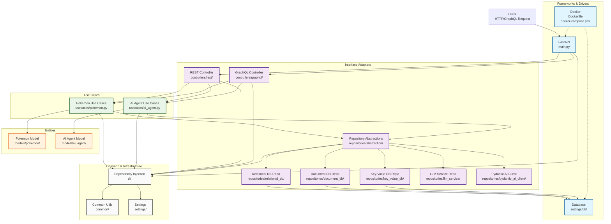
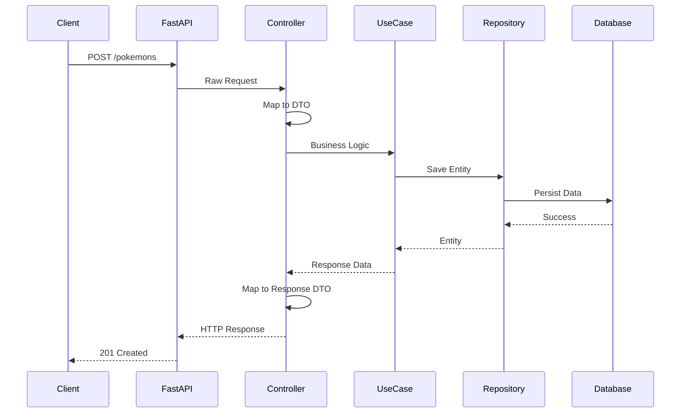

# Project Architecture Diagram

This diagram illustrates the Clean Architecture implementation of the Homunculy project, a Pokémon API built with FastAPI.

## Architecture Explanation

This project follows **Clean Architecture** principles with the following layers:

### Entities (Domain Layer)
- **Pokemon Model**: Core business entities for Pokémon data
- **AI Agent Model**: Core business entities for AI agent functionality

### Use Cases (Application Layer)
- **Pokemon Use Cases**: Application-specific business rules for Pokémon operations
- **AI Agent Use Cases**: Application-specific business rules for AI agent operations

### Interface Adapters
- **Controllers**: REST and GraphQL endpoints that adapt external requests to internal format
- **Repositories**: Multiple database implementations (Relational, Document, Key-Value) with abstractions for database independence

### Frameworks & Drivers
- **FastAPI**: Web framework handling HTTP requests
- **Database Settings**: Configuration for various database types
- **Docker**: Containerization for deployment

### Infrastructure
- **Dependency Injection**: Manages component dependencies and Unit of Work pattern
- **Common Utils**: Shared utilities and helpers
- **Settings**: Application configuration

## Data Flow Example (POST /pokemons)

## Supported Databases

The project supports multiple database types through different repository implementations:

- **Relational**: SQLite, MySQL, PostgreSQL (SQLAlchemy)
- **Document**: MongoDB
- **Key-Value**: Redis
- **LLM Service**: External AI services
- **Pydantic AI Client**: AI-powered operations

This architecture ensures:
- **Testability**: Each layer can be tested independently
- **Framework Independence**: Core business logic doesn't depend on external frameworks
- **Database Independence**: Business rules work with any database implementation
- **UI Independence**: API interfaces (REST/GraphQL) can be changed without affecting core logic</content>
<parameter name="filePath">e:\Personal\Learning\Homunculy\homunculy\docs\architecture-diagram.md