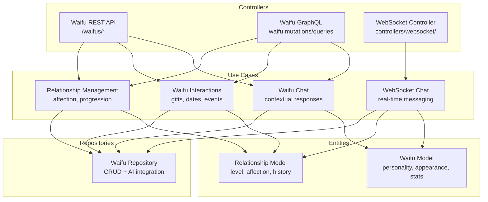
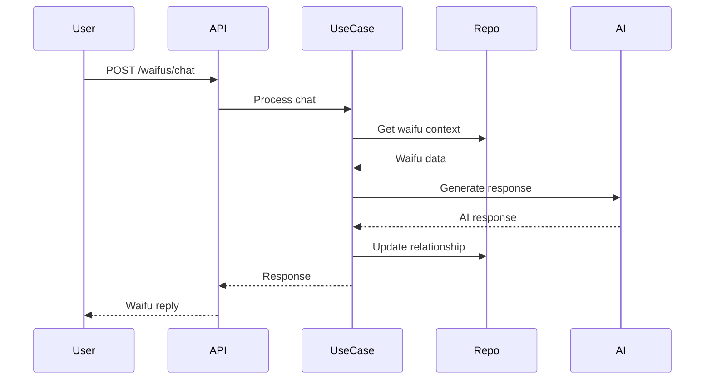
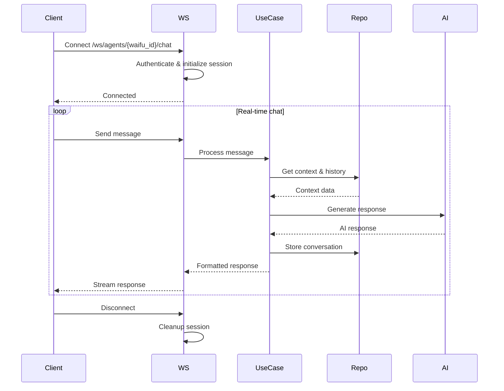

# Waifu Feature Design

## Overview
Waifu AI companion with personality, relationships, and interactions.

## Architecture



## Data Models

```mermaid
classDiagram
    class Waifu {
        +id: UUID
        +name: str
        +personality: dict
        +appearance: dict
        +stats: dict
        +created_at: datetime
    }

    class Relationship {
        +user_id: UUID
        +waifu_id: UUID
        +level: int
        +affection: int
        +events: list
        +last_interaction: datetime
    }

    class Interaction {
        +type: str
        +content: str
        +timestamp: datetime
        +affection_change: int
    }

    Waifu ||--o{ Relationship : has
    Relationship ||--o{ Interaction : contains
```

## API Endpoints

### REST API


### WebSocket Real-time Chat


## Key Features
- Personality-driven responses
- Relationship progression
- Event system
- **Real-time WebSocket chat**
- **Streaming AI responses**
- Integration with existing AI agent framework
- Minimal overhead on current architecture

## Implementation Notes
- Extend existing AI agent models
- Reuse repository patterns
- Add waifu-specific use cases
- **Implement WebSocket endpoints in controllers/websocket/**
- **Add connection management for real-time chat**
- Maintain clean separation</content>
<parameter name="filePath">e:\Personal\Learning\Homunculy\homunculy\docs\waifu-feature-design.md