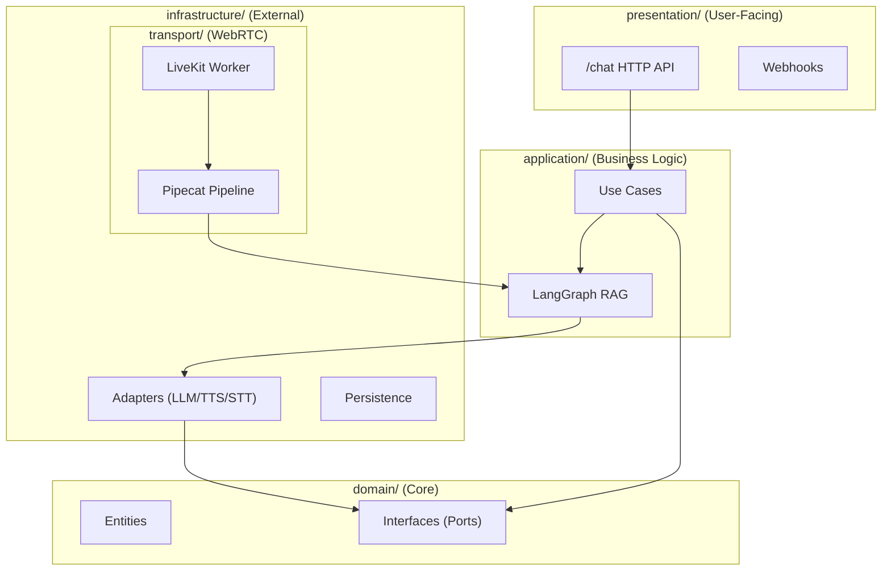

# Homunculy AI Agent Service

🤖 Python/FastAPI backend for conversational AI agents with real-time voice via LiveKit + Pipecat + LangGraph.

## Architecture



## Quick Start

```bash
poetry install && make up        # HTTP API on :8000
make test                        # 75 tests in parallel
```

## Voice Agent (LiveKit)

```bash
make livekit-up                  # Start local LiveKit server
make livekit-token ROOM=dev-room # Generate JWT token
make livekit-agent               # Run voice worker
```

Environment: `LIVEKIT_URL`, `LIVEKIT_API_KEY`, `LIVEKIT_API_SECRET`
