# Homunculy AI Agent Service

🤖 Python/FastAPI backend for AI agents with LangGraph.

## How It Works

```mermaid
graph LR
    LINE[LINE] -->|webhook| WH[Webhook Handler]
    API[REST API] -->|/chat| AH[Agent Handler]

    WH --> RI[RouteInbound]
    AH --> CU[ChatUseCase]

    RI --> GW[GatewayOrchestrator]
    CU --> LLM

    GW --> DS[DualSystem]

    DS --> R[Reflex<br/>fast ≤300ms]
    DS --> C[Cognition<br/>deep reasoning]

    R --> LLM[LLM Provider]
    C --> LG[LangGraph]
    LG --> LLM

    LG --> MEM[(Memory<br/>SQLite)]
    LG --> CP[(Checkpointer)]
```



## Layers


## Quick Start

```bash
poetry install && make up   # :8000
make test                   # 90+ tests
```

<!-- LiveKit and Pipecat removed -->
