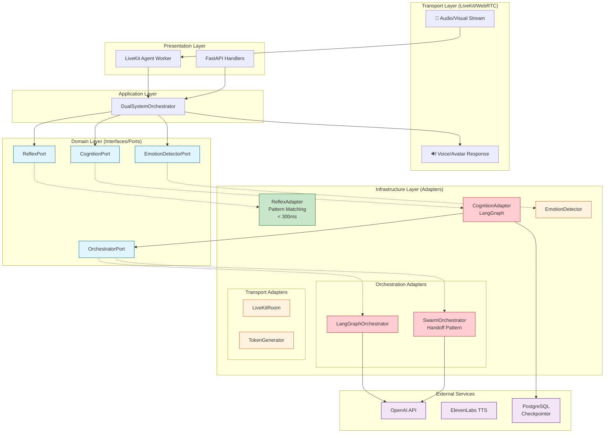
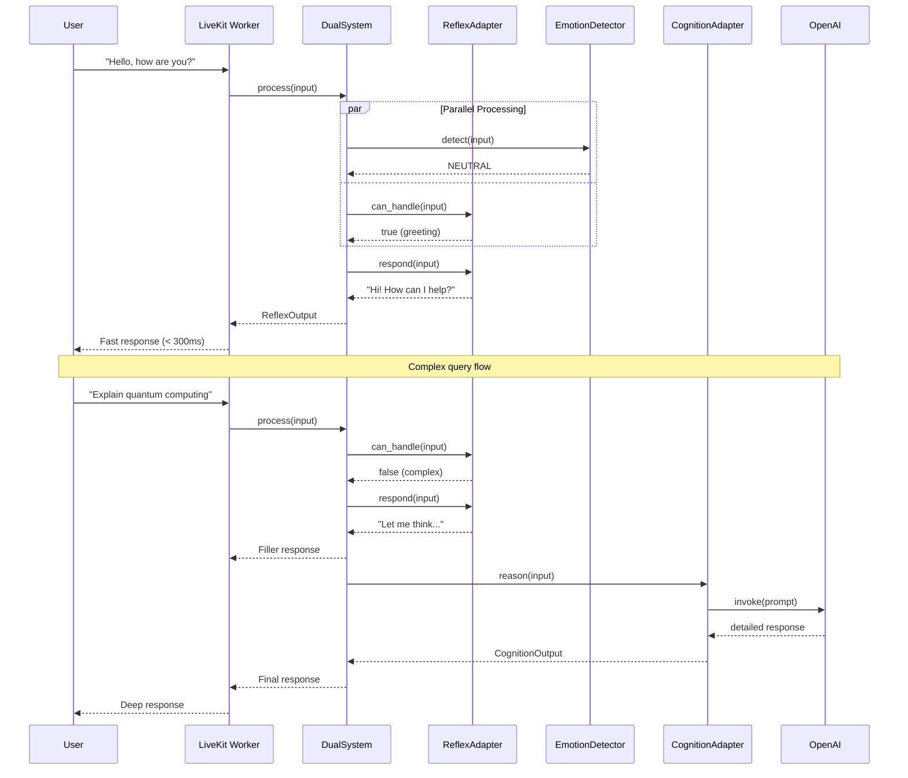

# Homunculy 2026 Architecture

## Hybrid Dual-System Architecture

This document describes the Clean Architecture implementation of the Homunculy AI agent using the 2026 Hybrid Dual-System pattern.

## Architecture Diagram



## Flow Diagram



## Layer Dependencies

```
┌─────────────────────────────────────────────────────────────┐
│                    Presentation Layer                       │
│  (FastAPI handlers, LiveKit worker, GraphQL)               │
│                         ↓                                   │
├─────────────────────────────────────────────────────────────┤
│                    Application Layer                        │
│  (Use cases, DualSystemOrchestrator)                        │
│                         ↓                                   │
├─────────────────────────────────────────────────────────────┤
│                      Domain Layer                           │
│  (Entities, Interfaces/Ports - NO external dependencies)   │
│                         ↑                                   │
├─────────────────────────────────────────────────────────────┤
│                   Infrastructure Layer                      │
│  (Adapters: LangGraph, LiveKit, OpenAI, Postgres)          │
│                                                             │
│  ┌──────────────┐  ┌──────────────┐  ┌──────────────┐      │
│  │ Dual-System  │  │ Orchestration│  │   Transport  │      │
│  │   Adapters   │  │   Adapters   │  │   Adapters   │      │
│  └──────────────┘  └──────────────┘  └──────────────┘      │
└─────────────────────────────────────────────────────────────┘
```

## Key Design Principles

### 1. Dependency Inversion (DIP)
- Domain layer defines interfaces (ports)
- Infrastructure implements these interfaces (adapters)
- Dependencies point inward (toward domain)

### 2. Single Responsibility (SRP)
- `ReflexAdapter`: Fast pattern-based responses only
- `CognitionAdapter`: Deep reasoning only
- `EmotionDetector`: Emotional tone detection only
- `DualSystemOrchestrator`: Coordination only

### 3. Open/Closed Principle (OCP)
- Add new orchestrators without modifying existing code
- Swap LangGraph for AutoGen via factory
- Add new transport (Daily) via adapter

### 4. Interface Segregation (ISP)
- `ReflexPort`: `respond()`, `can_handle()`
- `CognitionPort`: `reason()`, `stream()`
- `OrchestratorPort`: `invoke()`, `stream()`

### 5. Liskov Substitution (LSP)
- Any `OrchestratorPort` implementation works
- Swarm and LangGraph are interchangeable

## Directory Structure

```
src/
├── main.py                          # Entrypoint - ALL wiring here
├── domain/
│   ├── entities/                    # Business objects
│   │   ├── agent.py
│   │   ├── message.py
│   │   └── session.py
│   └── interfaces/                  # Ports (contracts)
│       ├── dual_system.py           # ReflexPort, CognitionPort
│       ├── orchestration.py         # OrchestratorPort
│       └── transport.py             # RoomPort, TokenGeneratorPort
├── application/
│   └── use_cases/
│       ├── chat.py
│       └── voice.py
├── infrastructure/
│   ├── container.py                 # DI container
│   └── adapters/
│       ├── factory.py               # Adapter creation
│       ├── dual_system/             # Reflex + Cognition adapters
│       │   ├── reflex.py
│       │   ├── cognition.py
│       │   ├── emotion.py
│       │   └── orchestrator.py
│       ├── orchestration/           # LangGraph, Swarm
│       │   ├── langgraph_adapter.py
│       │   └── swarm_adapter.py
│       └── transport/               # LiveKit
│           └── livekit_adapter.py
├── presentation/
│   └── http/
│       └── handlers/
└── tests/
    └── e2e/                         # End-to-end with testcontainers
        ├── conftest.py
        ├── test_dual_system.py
        └── test_api.py
```

## Running Tests

```bash
# Unit tests
cd homunculy && make test

# E2E tests with containers
cd homunculy && pytest src/tests/e2e/ -v

# Full stack with Aspire
cd aspire && dotnet run --project Homunculy.AppHost
```
