# 🏰 AKS Stack - Private Kubernetes Cluster with Public Ingress

> **"Fortress with a Drawbridge"** - API server hidden behind walls, but services accessible via secure public gateway.

## 📋 Table of Contents

- [Architecture Overview](#architecture-overview)
- [Network Flow](#network-flow)
- [Resource Map](#resource-map)
- [Security Layers](#security-layers)
- [Quick Start](#quick-start)

## Architecture Overview

```mermaid
graph TB
    subgraph Internet["☁️ INTERNET"]
        User["👤 User Browser"]
        DNS["🌐 nip.io DNS<br/>argocd.57.158.185.178.nip.io"]
    end
    
    subgraph Azure["Azure Cloud"]
        PublicIP["📡 Public IP<br/>57.158.185.178"]
        NSG["🛡️ NSG Rules<br/>Allow 80, 443"]
        
        subgraph NodeRG["Node Resource Group (MC_*)"]
            Ingress["🚪 Azure App Routing<br/>Managed NGINX Ingress<br/>TLS Termination"]
            LB["⚖️ Azure Load Balancer<br/>External"]
        end
        
        subgraph VNet["🧱 Private VNet (10.0.0.0/8)"]
            subgraph AKSSubnet["AKS Subnet (10.1.0.0/16)"]
                PrivateAPI["🔒 API Server<br/>Private Endpoint Only<br/>No Public IP"]
                
                subgraph Namespaces["Kubernetes Namespaces"]
                    direction LR
                    ArgoCD["🎯 argocd namespace<br/>- argocd-server pod<br/>- Port: 8080 HTTP"]
                    Homunculy["🏠 homunculy namespace<br/>- Python API pods<br/>- Go API pods"]
                end
                
                Services["🔌 Services<br/>- argocd-server (ClusterIP)<br/>- argocd-server-ilb (Internal LB)"]
            end
            
            subgraph DBSubnet["Database Subnet (10.2.0.0/24)"]
                PostgreSQL["💰 PostgreSQL<br/>Private Endpoint<br/>No Public Access"]
            end
            
            subgraph PESubnet["Private Endpoints (10.3.0.0/24)"]
                KeyVault["👑 Key Vault<br/>Private Endpoint"]
                ACR["⚔️ Container Registry<br/>Private Endpoint"]
            end
        end
        
        subgraph Security["🛡️ Security & Operations"]
            LogAnalytics["🗼 Log Analytics<br/>90-day retention"]
            Defender["🛡️ Microsoft Defender<br/>Runtime Protection"]
            Policy["📜 Azure Policy<br/>Pod Security"]
            Velero["🏺 Velero Backup<br/>Daily Snapshots"]
        end
    end
    
    User -->|HTTPS Request| DNS
    DNS -->|Resolves to| PublicIP
    PublicIP -->|Firewall Check| NSG
    NSG -->|Port 443 Allowed| LB
    LB -->|Forward to| Ingress
    Ingress -->|HTTP :80<br/>TLS Terminated| Services
    Services -->|Route to| ArgoCD
    
    ArgoCD -.->|Pulls Images| ACR
    ArgoCD -.->|Reads Secrets| KeyVault
    Homunculy -.->|Queries| PostgreSQL
    
    PrivateAPI -.->|Manages| ArgoCD
    PrivateAPI -.->|Manages| Homunculy
    
    AKSSubnet -.->|Logs & Metrics| LogAnalytics
    AKSSubnet -.->|Threat Detection| Defender
    AKSSubnet -.->|Policy Enforcement| Policy
    AKSSubnet -.->|Backup| Velero
    
    classDef public fill:#ff9999,stroke:#cc0000,stroke-width:2px
    classDef private fill:#99ff99,stroke:#00cc00,stroke-width:2px
    classDef security fill:#9999ff,stroke:#0000cc,stroke-width:2px
    classDef internet fill:#e1f5ff,stroke:#0088cc,stroke-width:2px
    
    class User,DNS,PublicIP,NSG,LB,Ingress public
    class PrivateAPI,PostgreSQL,KeyVault,ACR,Services,ArgoCD,Homunculy private
    class LogAnalytics,Defender,Policy,Velero security
    class Internet internet
```



**Key Points:**

- 🔴 **Red** = Public-facing (internet-accessible)
- 🟢 **Green** = Private (VNet-only, no public IP)
- 🔵 **Blue** = Security & monitoring services
- 🔒 **Private API Server** = Not accessible from internet, only via `az aks command invoke`

## Network Flow

### 🌐 External User → Argo CD UI

```mermaid
graph LR
    A[👤 User Browser] -->|HTTPS| B[🌐 nip.io DNS<br/>argocd.57.158.185.178.nip.io]
    B -->|Resolves to| C[📡 Public IP<br/>57.158.185.178]
    C -->|NSG Rule: Allow 443| D[🚪 Azure LB]
    D -->|Port 443| E[NGINX Ingress<br/>app-routing-system]
    E -->|TLS Termination| F[HTTP :80]
    F -->|Forward to| G[🎯 argocd-server svc<br/>ClusterIP: 10.0.x.x]
    G -->|Load Balance| H[🏠 argocd-server pod<br/>Port: 8080]
    
    style A fill:#e1f5ff
    style C fill:#ff9999
    style E fill:#99ff99
    style H fill:#ffcc99
```



**Traffic Path:**

1. **DNS Resolution**: `argocd.57.158.185.178.nip.io` → `57.158.185.178` (automatic via nip.io)
2. **NSG Check**: Azure NSG allows port 443 (ref: allow_https)
3. **Load Balancer**: Azure public LB forwards to NGINX pods
4. **Ingress**: NGINX terminates TLS, forwards HTTP to ClusterIP
5. **Service**: ClusterIP routes to healthy pod
6. **Pod**: Argo CD serves UI on port 8080 (insecure mode, TLS handled by ingress)

### 🔒 Private Cluster Access (kubectl)

```mermaid
graph TD
    A[👨‍💻 Developer] -->|Option 1| B[az aks command invoke]
    A -->|Option 2| C[Azure Bastion VM]
    B -->|Azure Control Plane| D[Private API Server<br/>10.1.x.x:443]
    C -->|VNet Peering| D
    D -->|Manages| E[Worker Nodes<br/>10.1.0.0/16]
    
    F[🚫 Public Internet] -.->|BLOCKED| D
    
    style D fill:#ff9999
    style F fill:#ffcccc
```



**Why Private Cluster?**

- ✅ **API server** has NO public IP (can't be scanned)
- ✅ **Control plane** only accessible via Azure Private Link
- ✅ **Worker nodes** communicate via private IPs only
- ❌ **Without**: API server exposed on port 6443 = prime target for attacks

## Resource Map

### [1] Network Security Group (NSG) Rules

**File**: [`main.tf#L126-L140`](./main.tf#L126-L140)

```terraform
resource "azurerm_network_security_rule" "allow_http" {
  # Allows internet → public IP on port 80
  # Required for: HTTP ingress traffic
  # Without: Cannot access apps via http://
}
```

**File**: [`main.tf#L142-L156`](./main.tf#L142-L156)

```terraform
resource "azurerm_network_security_rule" "allow_https" {
  # Allows internet → public IP on port 443
  # Required for: HTTPS ingress traffic
  # Without: Cannot access apps via https://
}
```

### [2] Azure App Routing (Managed Ingress)

**File**: [`main.tf#L310-L316`](./main.tf#L310-L316) (AKS module)

**What it is**: Microsoft-managed NGINX ingress controller

- ✅ **Auto-scaling**: Scales with your cluster
- ✅ **Auto-updates**: Microsoft patches vulnerabilities
- ✅ **Zero config**: Works out-of-box, no Helm charts
- ✅ **Public IP**: Automatically provisions Azure LB + Public IP

**How it works**:

```yaml
apiVersion: networking.k8s.io/v1
kind: Ingress
spec:
  ingressClassName: webapprouting.kubernetes.azure.com  # ← Magic keyword
```

### [3] Private Endpoints & VNet Integration

**File**: [`main.tf#L172-L193`](./main.tf#L172-L193)

**VNet Subnets**:

- **AKS Subnet** (`10.1.0.0/16`): Worker nodes, pods, services
- **Database Subnet** (`10.2.0.0/24`): PostgreSQL private endpoint
- **Private Endpoints Subnet** (`10.3.0.0/24`): Key Vault, ACR private links

**Why Private Endpoints?**

```text
WITHOUT:                          WITH:
Internet → PostgreSQL 💀          Internet ⛔→ PostgreSQL
(public IP, firewalled)           (no public IP, VNet-only)
```

### [4] Workload Identity (Passwordless Auth)

**File**: AKS module enables OIDC issuer

**Traditional** (❌ Bad):

```yaml
env:
  - name: AZURE_KEY_VAULT_SECRET
    value: "hardcoded-key-12345"  # ← Leaked in logs, Git history
```

**Workload Identity** (✅ Good):

```yaml
serviceAccount:
  annotations:
    azure.workload.identity/client-id: "..."  # ← Pod gets token from Azure AD
# No secrets in code!
```

### [5] Security Stack

#### Container Registry (ACR)

**File**: [`main.tf#L234-L246`](./main.tf#L234-L246)

- ✅ **Private images**: Not on Docker Hub (supply chain attacks)
- ✅ **Vulnerability scanning**: Defender scans every push
- ✅ **RBAC**: Only GitHub Actions can push, AKS can pull

#### Monitoring & Logs

**File**: [`main.tf#L214-L224`](./main.tf#L214-L224)

**Log Analytics** collects:

- Container logs (stdout/stderr)
- Kubernetes events (pod crashes, OOM kills)
- Security events (privilege escalation attempts)
- Performance metrics (CPU, memory, disk)

**Retention**: 90 days (prod), 30 days (dev)

#### Velero Backup

**File**: [`main.tf#L351-L372`](./main.tf#L351-L372)

**Backs up**:

- All pod definitions (Deployments, StatefulSets)
- ConfigMaps & Secrets
- Persistent Volumes (if enabled)

**Disaster Recovery**:

```bash
# Cluster destroyed? Restore in minutes:
velero restore create --from-backup daily-backup-20241207
```

## Security Layers

| Layer | Technology | What it blocks |
|-------|-----------|----------------|
| **1. Network** | NSG Rules | DDoS, port scanning, unwanted traffic |
| **2. Ingress** | NGINX + TLS | HTTP attacks, no encryption |
| **3. API Server** | Private Endpoint | Direct cluster access from internet |
| **4. Pod-to-Pod** | Network Policy | Lateral movement after breach |
| **5. Container** | Azure Policy | Privileged containers, root users |
| **6. Runtime** | Defender | Malware, crypto miners, reverse shells |
| **7. Secrets** | Key Vault + CSI | Hardcoded credentials in code |
| **8. Identity** | Workload ID + RBAC | Credential theft, over-privileged pods |

## Quick Start

```bash
# 1. Initialize Terraform
cd infra/terraform/stacks/aks
terraform init -backend-config=../../environments/prod/backend.tfvars

# 2. Plan infrastructure
terraform plan -var-file=../../environments/prod/aks.tfvars

# 3. Apply (creates everything)
terraform apply -var-file=../../environments/prod/aks.tfvars

# 4. Get Argo CD URL and password
terraform output argocd_url
# → https://argocd.57.158.185.178.nip.io

az aks command invoke \
  --resource-group rg-homunculy-aks-prod \
  --name aks-homunculy-prod \
  --command "kubectl -n argocd get secret argocd-initial-admin-secret -o jsonpath='{.data.password}' | base64 -d"
```

## Common Operations

### Access Private Cluster

```bash
# Option 1: Run commands via Azure (no VPN needed)
az aks command invoke \
  --resource-group rg-homunculy-aks-prod \
  --name aks-homunculy-prod \
  --command "kubectl get pods -A"

# Option 2: Get kubeconfig (requires VPN/Bastion)
az aks get-credentials \
  --resource-group rg-homunculy-aks-prod \
  --name aks-homunculy-prod
```

### Check Ingress Status

```bash
az aks command invoke \
  --resource-group rg-homunculy-aks-prod \
  --name aks-homunculy-prod \
  --command "kubectl get ingress -A"
```

### View Logs

```bash
# In Azure Portal:
# AKS Cluster → Logs → Run query:
KubePodInventory
| where Namespace == "argocd"
| project TimeGenerated, Name, ContainerStatus
```

## Troubleshooting

### Can't access Argo CD UI

**Check 1**: NSG rules exist

```bash
az network nsg rule list \
  --resource-group MC_rg-homunculy-aks-prod_aks-homunculy-prod_southeastasia \
  --nsg-name aks-agentpool-*-nsg \
  --query "[?direction=='Inbound'].{name:name,port:destinationPortRange}" -o table
# Should show: AllowHTTPInbound (80), AllowHTTPSInbound (443)
```

**Check 2**: Ingress has IP

```bash
az aks command invoke ... --command "kubectl get ingress -n argocd"
# ADDRESS column should show: 57.158.185.178
```

**Check 3**: Argo CD in insecure mode

```bash
az aks command invoke ... --command "kubectl get cm argocd-cmd-params-cm -n argocd -o yaml | grep insecure"
# Should show: server.insecure: "true"
```

### Private cluster access issues

**Error**: "Unable to connect to the server"

- ✅ **Use**: `az aks command invoke` (bypasses private endpoint)
- ❌ **Don't use**: `kubectl` directly (requires VPN)

## Cost Breakdown

| Resource | SKU | Monthly Cost (USD) |
|----------|-----|-------------------|
| AKS Control Plane | Free | $0 |
| Worker Nodes (2x B2s_v2) | 2 vCPU, 4 GB RAM | ~$30 |
| PostgreSQL | B_Standard_B1ms | ~$12 |
| Key Vault | Standard | ~$1 |
| ACR | Standard | ~$5 |
| Log Analytics | 5 GB/month | ~$10 |
| Public IP | Static | ~$3 |
| **Total** | | **~$61/month** |

**Free tier includes**:

- AKS control plane (no charge)
- First 5 GB logs (included in workspace)
- Azure Policy (included with AKS)

---

**Next Steps**: Deploy workloads → [../../k8s/README.md](../../k8s/README.md)
